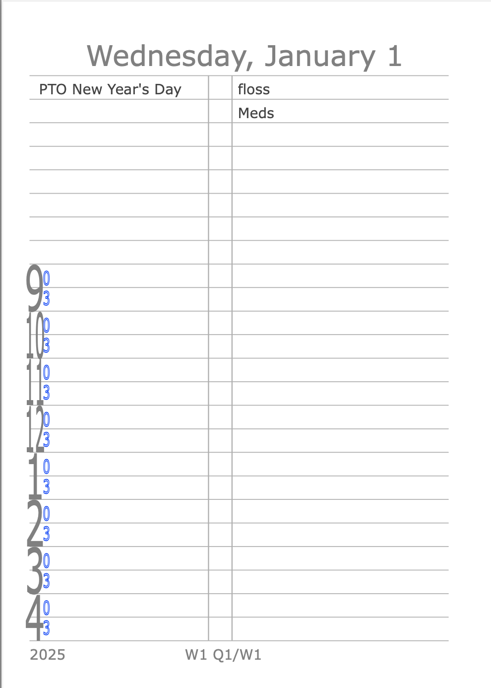
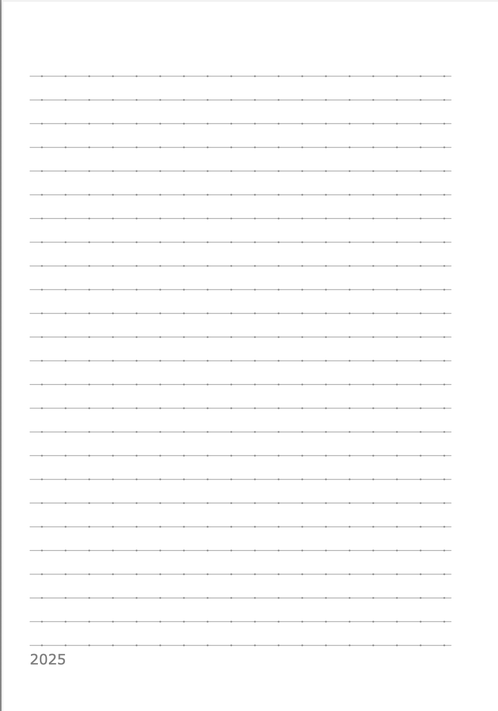
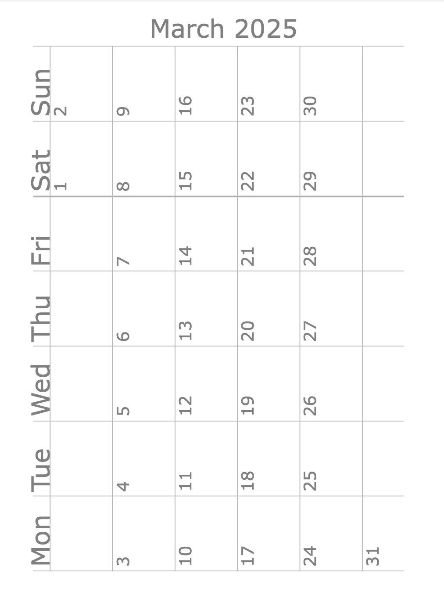
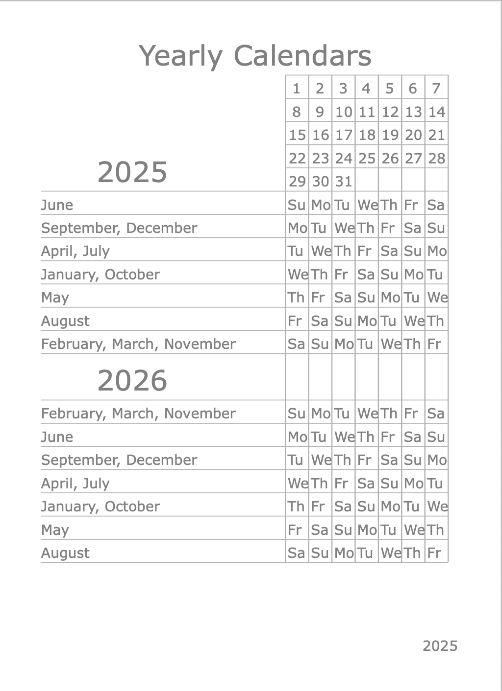

For a few years, I've been carrying a Lihit Labs A6 notebook, similar to [this one](https://www.jetpens.com/Lihit-Lab-Pastello-Twist-Ring-Notebook-A6-Lined-Light-Green/pd/35245) as a pocket mini-organizer. At first I hand lined the pages. But the paper that comes with them isn't great for fountain pens. And being a tech guy, I started generating the pages and refining them using paper that I chose. This is the code that generates the pages.

WARNING: this code is in no way a paragon of good software engineering. It started off as a hack and has grown/congealed into what it is. I could use mustache templates, I could commonize a bunch of stuff. I could put in constants for the magic values that are sprinkled througout. At some point I might bother cleaning all this up. But hey! I've got unit tests though for the date logic around holidays and todos. But most importantly, it's fit for purpose, for me. If it works for you, fantastic! Let me know, and that might inspire me to clean all this up.

There are a few different page types:
* daily calendar pages, with checkboxes on the right for todos, and timed
  items on the left for meetings and such from 9am-5pm
* dotted-lined pages (inspired by what Kokuyo has) for whatever. Line spacing is 5mm
* Monthly calendar pages
* A "title page" with a way to figure out what day a given date falls on for the current and subsequent year.






You can see a sample pdf [here](orgpages-sample.pdf)
# If you want to use this yourself
First, strap-in, it's not been made easy, but it also shouldn't be terribly hard

* You'll want (currently) Python 3.13
* do a pip install of what's in requirements.txt
* You'll need inkscape installed
* You'll need pdfunite installed (part of poppler-utils)
* If you're not on a mac, you'll need to fix makepdfs.sh to alter the path to inkscape, at least. There may be other Mac-isms.
  
That should get the stuff working. Now you'll want to create a `todo_holidays` subdirectory with two files: `holidays.yaml` and `todos.yaml`. The format for both is the same. The difference is that with holidays, it's assumed there's only one or two per given day, whereby with todos, the assumption is that there will be less than 24 per day. With holidays showing up at the top left in the lined area of the pages, and todos showing up next to the checkboxes.

The format of the yaml files is:
```
yearly:  # for legacy historical reasons, and I've not gotten around to fixing it
    DATESPEC: your text for the thing
```

The software isn't smart about the text. That is, it won't truncate it if it's
too long, if it contains things like ampersands, it won't escape them when it
puts it into the svg intermediate form it makes, etc.

`DATESPEC` on the other hand is pretty smart. It's a comma delimited list of two or three things:
* MONTH - If a month name, only match dates that are in this month. This can be left off if you want to match every month.
* DAY - Where you can have one of the days of the week like `Monday`, or `Day`
* NUMBER - if you have something like `Monday` for DAY this number will be which monday of the month. It can also be negative for when you need it to be something like the last monday of the month. If you have `Day` as DAY, this will be the day of the month. If the number is negative, you can use this to express things like the last day of the month. If NUMBER is instead `*`, it will apply to
anything that would match DAY. So you can express every Monday as `Monday,*`. If you want to do something every day, you can express it as `*,*` or `Day,*`.

Another variant of `DATESPEC` is for things that recur from an anchor date. In which case you spec it as these three things:
* DATE - as YYYY-MM-DD - which is the anchor date for the recurrence
* INTERVAL_UNIT - supports `week` and `day` as values. Monthly as a unit isn't supported because I just make multiple entries for them.
* INTERVAL_QUANTITY - for example: if you want something to recur every two weeks (fortnightly)  starting on Feb 2, 2025, you would specify it as `2025-02-08,week,2`

There are example `holidays.yaml` and `todos.yaml` files included.

# How to run it
Once you have holidays and todos yamls created, you run
```
bash makepdfs.sh STARTING_DATE NUMDAYS
```
Where `STARTING_DATE` is in YYYY-MM-DD format, and `NUMDAYS` is the number of daily pages to create. I think it checks that it's even, as it's intended to print double sided.

The output of this, assuming no failures, which it shouldn't, will be an 
`orgpages.pdf` file intended to be printed duplex on A4 paper, that I then 
guillotine into A6 pages and punch for my pocket Lihit Labs notebook. The 
PDF will contain the dated pages, lined pages, monthly pages, and the title 
page. if `NUMDAYS` isn't divisible by 8, there will be extra lined pages as 
filler. So when you print it, you probably don't want to blindly print the 
whole thing. Also, you want to print it scaled at 100%. At least for me,
the print dialog wants to do something less.

Other caveat is that I had to fiddle things to get it so that where it printed things on both sides of the page lined up correctly. I don't know how much of that is specific to my printer. So if they don't line up for yours, fiddling will need to take
place, and you'll have to figure that one out on your own.

